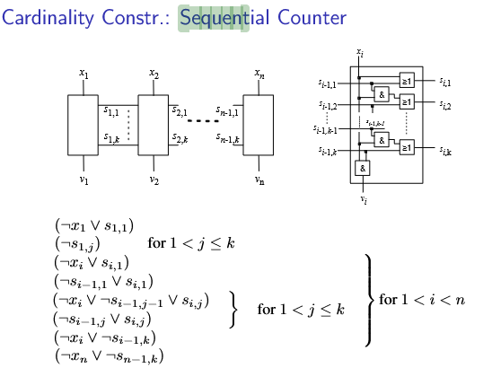

a) Wie kann man einen at-least-k contraint der Form durch einen
at-most-k' constraint ausdrücken

=> Sei n die Anzahl der Variablen im Problem  
=> Sei eine Formel für ein at-most-k' Problem gegeben  
=> k + k' = n, wobei k die Anzahl der negierten Variablen ist  
Eine Formel zum validieren eines at-most-k' Problems stellt sicher, dass maximal k' der n Variablen negiert vorkommen. 
Dementsprechend gibt es mindestens (at-least-k) Variablen, die nicht negiert vorkommen.

=> eine at-most-k' constraint ist äquivalent zu einer at-least-(n-k') 'negated' constraint  
=> durch Invertierten Literale einer at-most-k' constraint wird diese zu einer at-least-k constraint mit k = n - k' 

b)  

=> every Clause with j can be ignored as it has to satisfy 1 < j < k wihich is not possible with k = 1  
-x 1       ||  s  1   ,1  
-x i       ||  s  i   ,1  
-s (i-1),1 ||  s  i   ,1  
-x i       || -s (i-1),1  
-x n       || -s (n-1),1  

=> we can't use unit propagation as we don't have any units

c)...?
